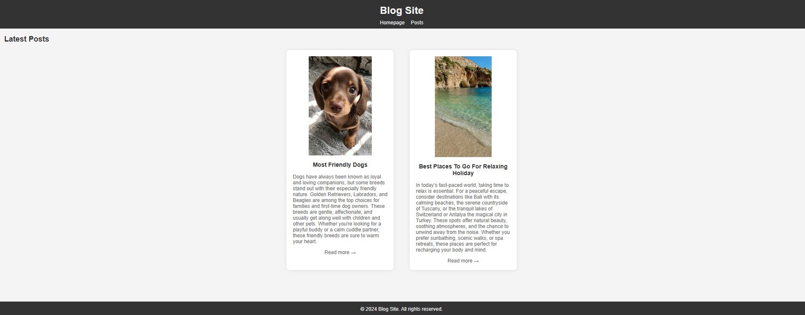
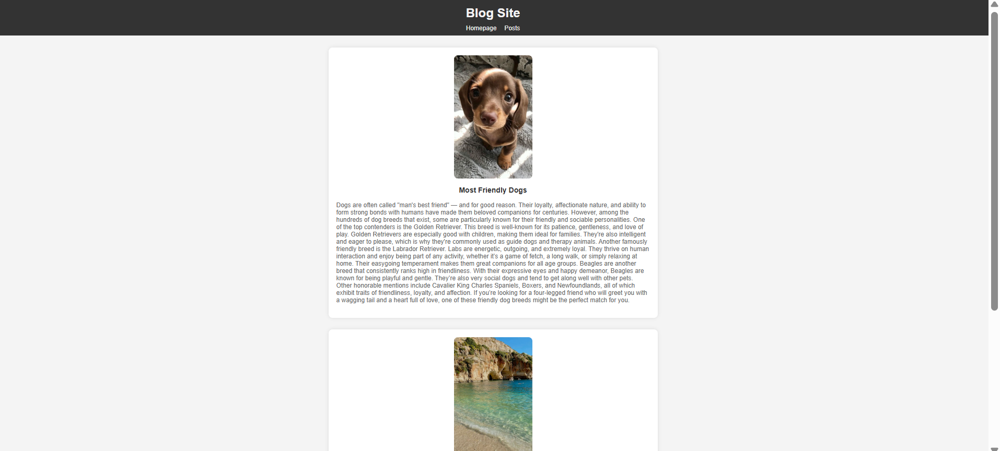

# 📝 Blog Site Project

This is a simple and responsive blog site project created using only **HTML and CSS**. It demonstrates the use of basic layout techniques, navigation bar creation, article structuring, and internal page linking.

## 🖼 Preview

## 📁 Project Structure
project-folder/
│
├── index.html # Homepage displaying latest blog summaries
├── post.html # Full blog content for each post
├── images/ # Folder containing images used in blog posts
│ ├── dog.jpeg
│ └── holiday.jpeg
└── README.md # Project explanation

## 🚀 Features

- A responsive **navigation bar** with links to homepage and post page
- Two sample blog articles:  
  - 🐶 *Most Friendly Dogs*  
  - 🌴 *Best Places To Go For Relaxing Holiday*
- “Read more” links on the homepage that smoothly navigate to the related post using anchor tags (`#id`)
- Clean and minimalist layout using inline CSS styles
- Footer with basic copyright

## 🔗 Internal Linking

The homepage contains two “Read more →” links:
- `post.html#dog` → Scrolls to the "Most Friendly Dogs" article
- `post.html#holiday` → Scrolls to the "Best Places to Go For Relaxing Holiday" article

These anchor links allow users to jump directly to the specific blog content.

## 📸 Images

Images used in this project should be placed inside the `images` folder. Make sure the filenames match:
- `images/dog.jpeg`
- `images/holiday.jpeg`

## 🧠 What You Learn From This Project

- How to structure a basic HTML document
- Creating a responsive navigation bar using Flexbox
- Adding internal links using `id` and anchor navigation
- Styling elements directly with `style` attributes (inline CSS)
- Organizing content using semantic HTML tags like `<article>` and `<footer>`

## ✅ To View the Site

You can open the `index.html` file in your browser by simply dragging and dropping it into the browser window or using the "Live Server" extension in VS Code.

## ©️ License

This is a basic front-end HTML practice project. Free to use for educational purposes.

