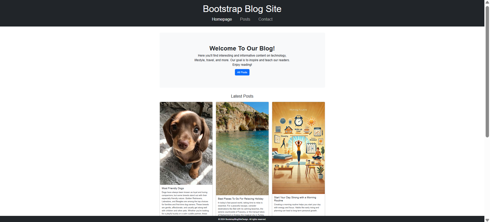
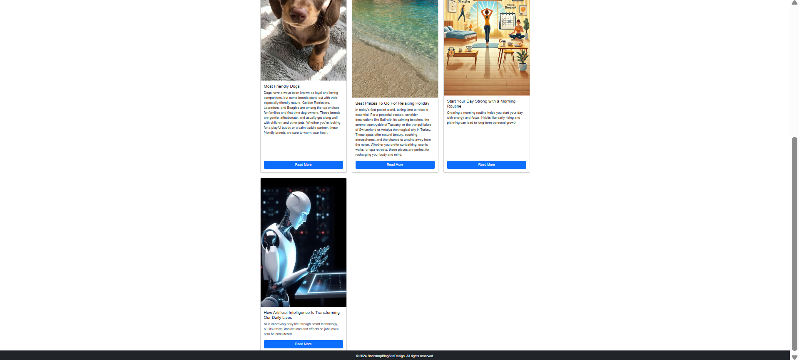
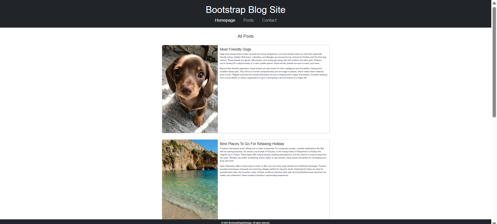
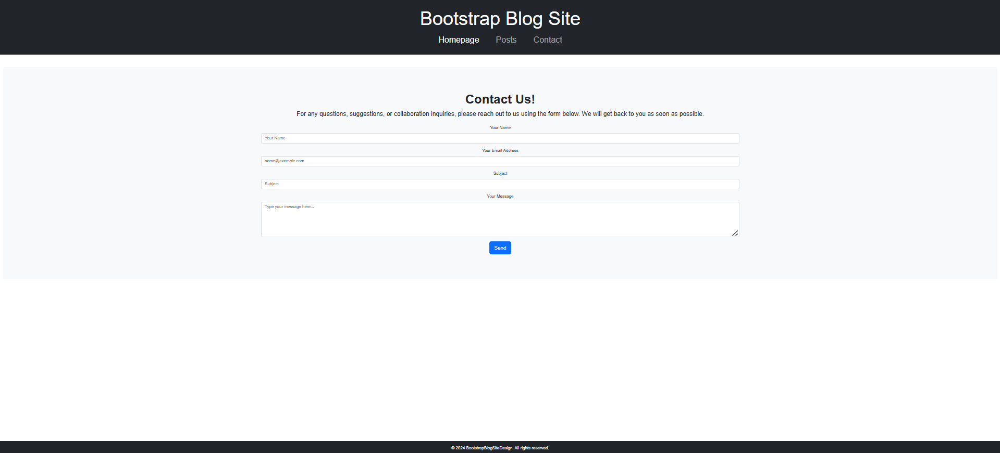

## Bootstrap Blog Site
This project demonstrates how to re-design a basic blog website using Bootstrap 5. It shows how a previously pure CSS-based blog site design can be transformed into a modern and responsive structure.

## Screenshots

## Features
Responsive Design: Seamless viewing on all devices (desktop, tablet, mobile) thanks to Bootstrap's grid system.

Dark-Themed Navbar: A stylish, dark-colored, and centered design for the heading and navigation menu.

Hero Section (Jumbotron): A wide and prominent section on the homepage introducing the content.

Blog Cards: Bootstrap card components used to display recent blog posts on the homepage.

Grid Layout: A flexible grid system that allows cards to be neatly arranged in 3 columns (on medium and large screens) or a single column (on small screens) across different screen sizes.

Equal Card Height: All blog cards maintain the same height thanks to the h-100 class.

Detailed Post Page: Each blog post is displayed in detail within a single, wide card on the posts.html page.

Contact Form: A responsive contact form created using Bootstrap form components on the contact.html page.

Fixed Footer: A footer that remains fixed at the bottom of the page, visible even when the user scrolls.

Setup and Usage
Running this project on your local machine is quite straightforward.

Clone the Repository:

git clone https://github.com/selinbsa/patika-frontend.git 

Navigate to the Project Directory:

cd patika-frontend/BlogSiteDesign 

Open in Your Browser:
Open the index.html file in your favorite web browser (Chrome, Firefox, Edge, etc.). Simply double-clicking the file will suffice.

The project does not require any server setup or additional dependencies, as all Bootstrap files are loaded via CDN (Content Delivery Network).

## Project Structure
.
├── index.html          # Homepage
├── posts.html          # Page containing all blog posts
├── contact.html        # Contact form page
├── style.css           # Custom CSS styles
└── images/             # Blog images (dog.jpeg, holiday.jpeg etc.)

## Technologies Used
HTML5

CSS3

Bootstrap 5.3.3 (via CDN)

## Contributing
If you would like to contribute to the development, please feel free to create a pull request.

## License
This project is open-source and released under the MIT License.
