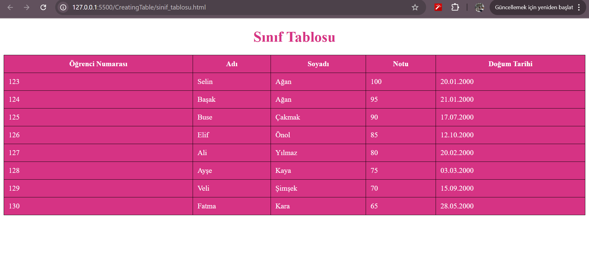

# CreatingTable - Student Table Project

This project displays a student table created using basic HTML. Inline CSS is used to style the table with pink tones. The table includes student information such as number, name, surname, grade, and date of birth.

## Features

- Built with plain HTML
- Uses `<thead>` and `<tbody>` for table structure
- Styled with inline CSS (no external or internal stylesheets)
- Table headers and rows use a pink color theme
- Each cell has a border and padding
- Header is centered and colored

## Screenshot

 

