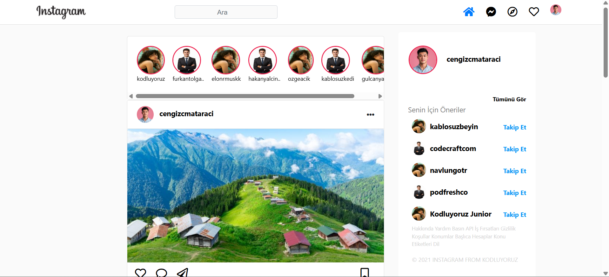

## Instagram Bootstrap Clone
This project is a simple Instagram interface clone built using Bootstrap 4 and fundamental web technologies (HTML, CSS). Its purpose is to practically apply Bootstrap's grid system, flexbox, components, and responsive design features.

## Screenshots

## Features

Fixed Navbar: A navigation bar that remains fixed at the top of the screen even when scrolling down, with a white background and a height of 54px.

Responsive Design: The search bar and top-right menu icons in the navbar automatically hide on small screen sizes (sm).

Custom Navbar Alignment: The logo is positioned on the left, the search bar in the center, and the menu icons on the right.

Placeholder Search Icon: A custom search icon is displayed behind the placeholder text of the search bar.

Stories Section: A horizontally scrollable section for user stories. Story owners' names are located directly below their respective images.

Post Feed: A centered and responsive feed of post cards.

Post headers include the user's profile picture and username, with an ellipsis icon aligned to the right.

The like, comment, and share icons section has no borders.

The Save (Bookmark) icon is aligned to the far right of the post icons list.

Card headers and footers have a white background.

The comment/share text is aligned to the right.

Right Panel (Suggestions): A sticky right panel that remains visible when scrolling down the page.

The panel has a white background and no border.

The "See All" and "Follow" texts are aligned to the right.

Local Image Support: The project uses locally loaded images from the assets folder instead of external URLs, providing a more reliable display experience.

General Background: The overall page background color is Instagram's typical light gray tone.

## Technologies
HTML5

CSS3

Bootstrap 4.5.3

FontAwesome (for Icons)

## Setup and Usage
1. Clone the Project:

git clone <project-repo-address>
cd instagram-clone

(If you are not using a Git repository, you can skip this step and download the files directly.)

2. Create the File Structure:
Ensure your project directory is structured as follows:

instagram-clone/
├── index.html
├── css/
│   └── style.css
└── assets/
    ├── instagram_logo.png
    ├── profile_pic_cengiz.jpg
    ├── story_kodluyoruz.jpg
    ├── post_rize.jpg
    ├── search-icon.png
    └── ... (All other mentioned images will go here)

Create the assets folder (if it doesn't exist) and download all images specified in the HTML code (Instagram logo, profile pictures, story images, post images, search icon, etc.) into this folder, making sure to name them correctly.

3. Open in Browser:
Open the index.html file in your favorite web browser.

## Contributing
If you would like to contribute to the development, please open an "issue" or send a "pull request".

## License
This project is licensed under the MIT License. See the LICENSE file for more information.
