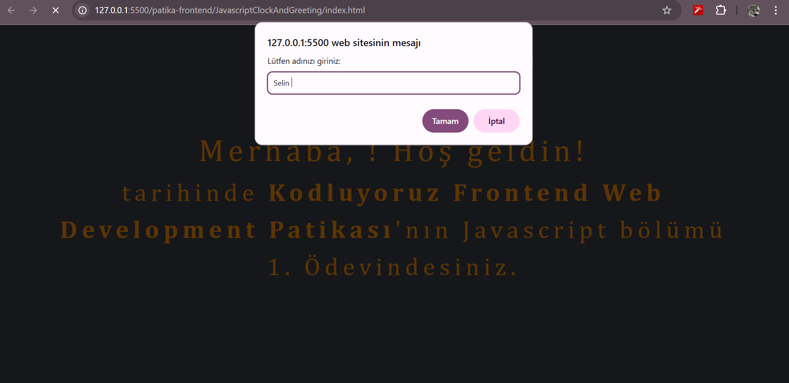
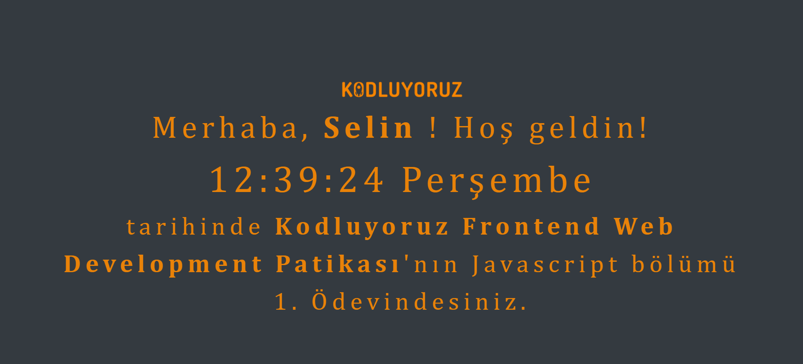

# ⏰ Kodluyoruz Javascript Saat Ödevi

Bu proje, [Kodluyoruz](https://kodluyoruz.org) Frontend Web Development Patikası’nın **Javascript bölümü 1. ödevi** kapsamında geliştirilmiştir.  

## 📌 Proje Özeti
- Kullanıcıdan **isim** bilgisi alınıyor (`prompt` ile).  
- İsim ekranda kullanıcıya hoş geldin mesajıyla gösteriliyor.  
- **Saat** ve **gün** bilgisi ekranda canlı olarak görüntüleniyor.  
- Görsel öğeler için **Bootstrap** ve özel **CSS** kullanıldı.  

## 🖼️ Ekran Görüntüsü



> Not: `screenshot.png` dosyasını projenizin kök dizinine ekleyebilirsiniz.

## 🚀 Kullanılan Teknolojiler
- HTML5  
- CSS3  
- Bootstrap 4.6 (CDN)  
- JavaScript (ES6)  

## 📂 Dosya Yapısı
.
├── index.html
├── css
│ └── style.css
└── js
└── clock.js


## ⚙️ Kurulum & Kullanım
1. Bu projeyi bilgisayarınıza klonlayın:
   ```bash
   git clone https://github.com/kullaniciadi/proje-adi.git


2. Proje klasörünü açın ve index.html dosyasını tarayıcıda çalıştırın.

3. Açılışta sizden isim istenecek, ardından ekranda saat ve gün ile birlikte karşılanacaksınız.

## ✨ Özellikler

Dinamik isim karşılama

Canlı saat ve gün güncellemesi (her saniye)

Koyu arka plan ve turuncu metin teması