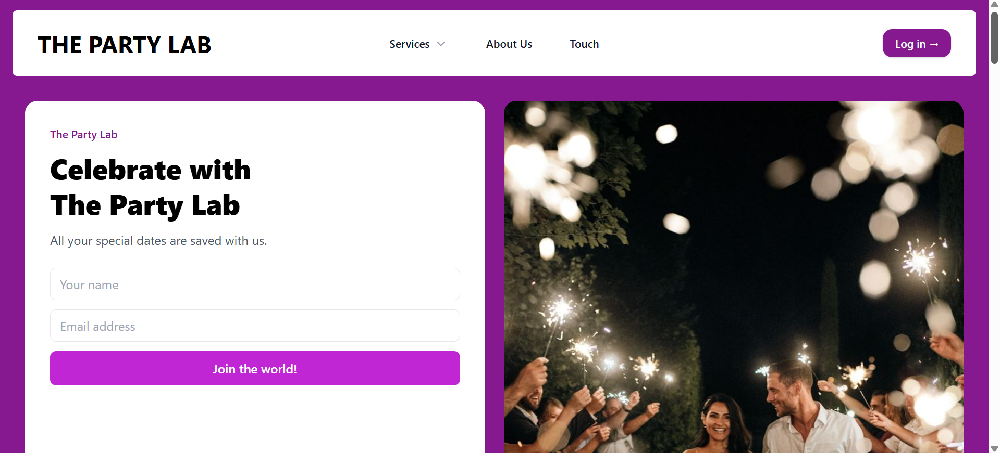
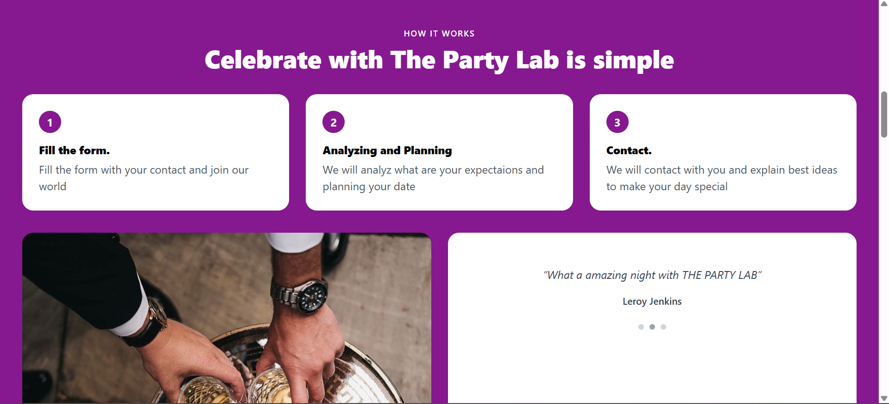
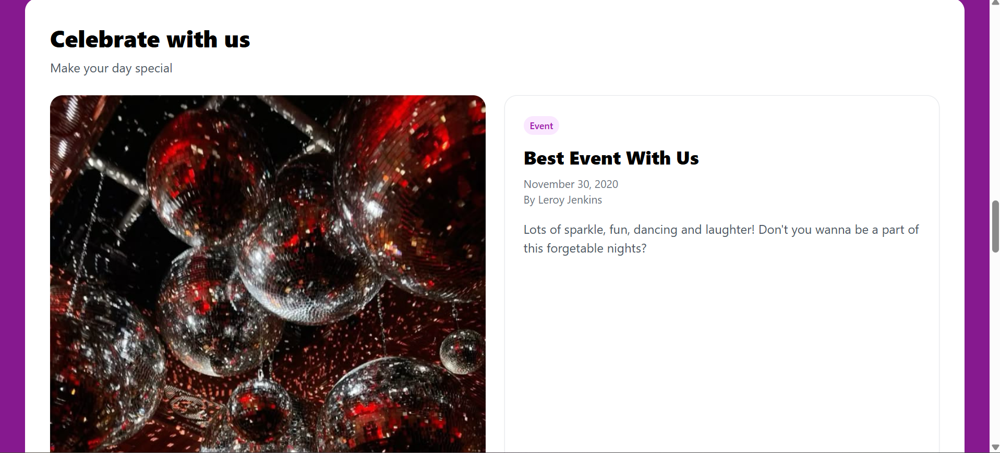
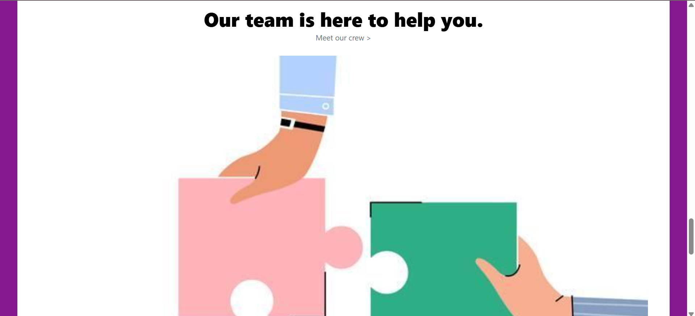
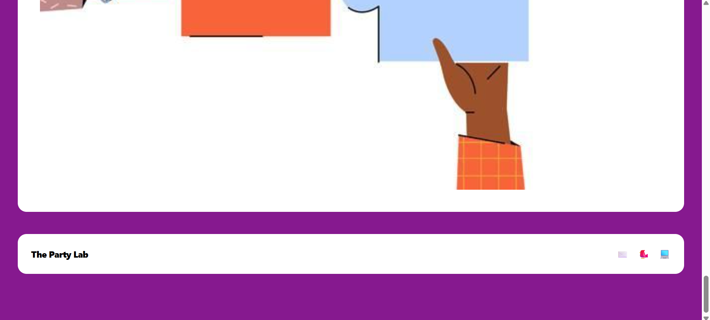

The Party Lab — Tailwind Landing Page

A fuchsia/pink-themed, card-based landing page built with Tailwind CSS (CDN).
Includes a header/nav, two-column hero (form card + image), “How it works” steps, image + testimonial, “Create with us” blog block, three info cards, a “Our team” section, and a footer.

🖼️ Screenshots

Add images under screenshots/ and reference them:

✨ Features

Tailwind CDN for zero-config setup

Fuchsia/pink color palette (fuchsia family)

Rounded cards (rounded-2xl) and soft shadows

Responsive grid layouts

Hero form (name, email, CTA)

Easy image swaps (Unsplash demo links)

🧱 Project Structure
.
├─ index.html
├─ images/
│  ├─ Events.jpg          
│  ├─ Thebachelorparty.jpg          
│  ├─ WeddingCeleb.jpg          
│  └─ team.jpg         
└─ README.md         

🔧 Setup & Run

No build step needed — it works with Tailwind CDN.

Clone:

git clone https://github.com/<selinbsa>/<patika-frontend>.git
cd <LandingPageClone>

Open:

Double-click index.html in your browser, or

Use VS Code → Live Server → “Open with Live Server”.

🎨 Customization Tips

Background (fuchsia shades):

<body class="bg-fuchsia-50"> <!-- try: bg-fuchsia-100/200/500/600/700/800 -->

Logo text size:

  THE PARTY LAB

Go larger with text-5xl / text-6xl if needed.

Header corners & shadow:

<header class="bg-white/90 backdrop-blur rounded-2xl shadow-sm ...">

Cards:

...

Team image (show full image without cropping):

If you must keep a fixed height but still show the full image, use object-contain.

Replace demo images:
Update src="..." paths in index.html to your files in images/.

🌐 Deploy to GitHub Pages

Ensure index.html is in the repo root.

Push:

git add .
git commit -m "Initial commit"
git push origin main

On GitHub: Settings → Pages

Source: Deploy from a branch

Branch: main and / (root)

Save. Your site will appear at:
https://<your-username>.github.io/<your-repo>/

If you get 404: check filename case sensitivity and that index.html is at the root.

🛠️ Optional: Build Tailwind for Production

CDN is perfect for prototyping. For smaller CSS in production:

npm init -y
npm install -D tailwindcss postcss autoprefixer
npx tailwindcss init -p

Create src/input.css:

@tailwind base;
@tailwind components;
@tailwind utilities;

Build:

npx tailwindcss -i ./src/input.css -o ./dist/output.css --minify

Then include dist/output.css in your HTML instead of the CDN script.

✅ Roadmap / TODO

 Sticky navbar

 Dark mode

 Scroll animations

 Form backend integration (waitlist)

🤝 Contributing

PRs are welcome. Fork → create a branch → commit changes → open a PR.

📄 License

MIT — add a LICENSE file if you want.
Helpful reference: https://choosealicense.com/licenses/mit/