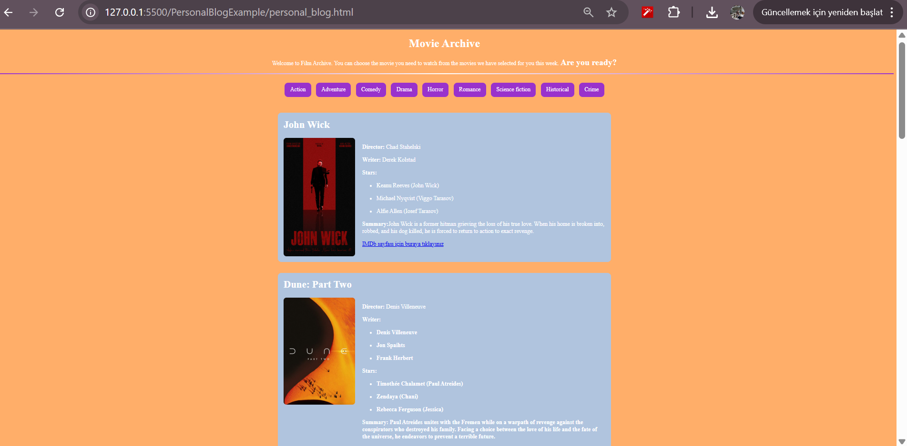

# 🎬 Movie Archive Website

Welcome to the **Movie Archive** — a selection of films across different genres including action, adventure, comedy, drama, horror, romance, science fiction, historical, and crime.

## 🌟 Features

- HTML5-based static web page
- Clean and visually structured sections per genre
- Internal navigation via anchor links
- Movie details including poster, director, writer(s), stars, summary, and IMDb link

## 📂 Project Structure
project-folder/
├── index.html
├── John Wick.jpeg
├── Dune.jpeg
├── AileArasinda.jpeg
├── Marriage Story.jpeg
├── TheConjuring.jpeg
├── The Notebook.jpeg
├── Interstellar.jpeg
├── Fetih 1453.jpeg
├── Seven.jpeg
└── README.md

## 📸 Screenshot

## 📸 Preview

You can view the page locally at:

http://127.0.0.1:5500/PersonalBlogExample/personal_blog.html

## 📌 Technologies Used

- HTML5
- Inline CSS for layout and styling
- No JavaScript — fully static

## 🔗 External References

- IMDb links for each movie provided inside the page

