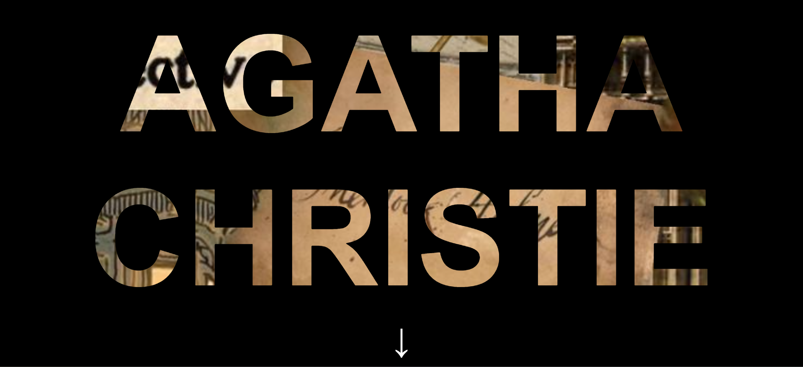
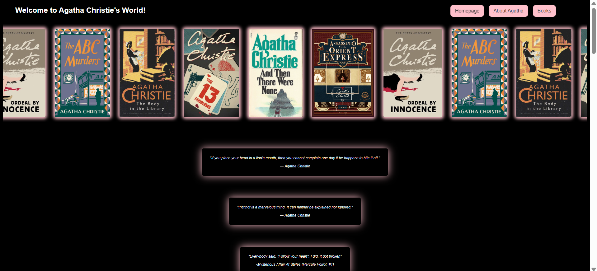
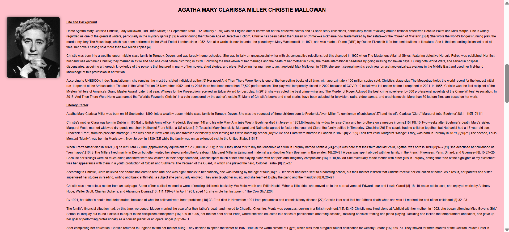
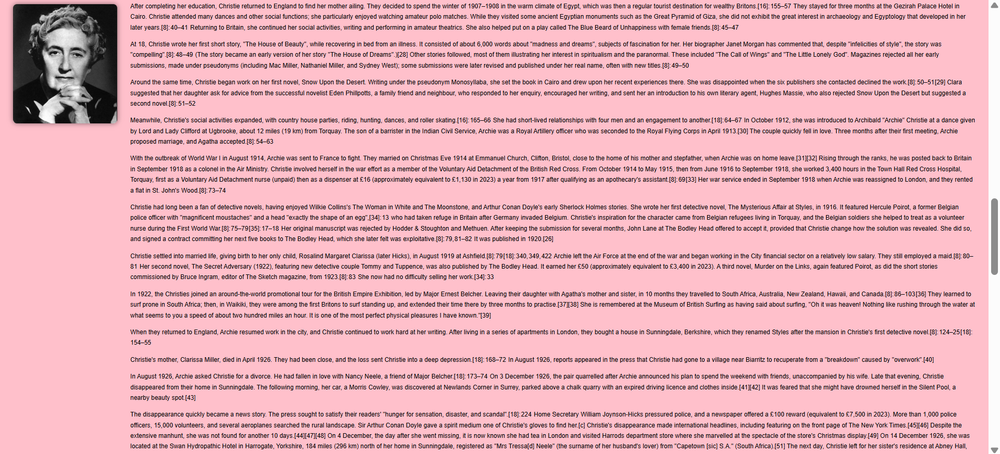
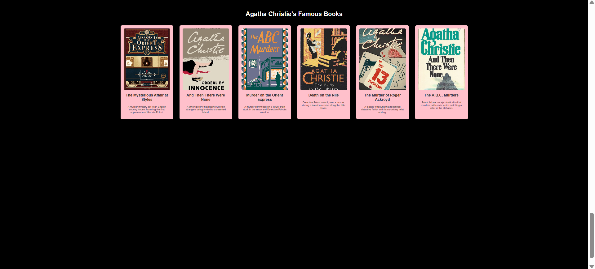

# 🎩 Agatha Christie Tribute Website

This project is a tribute website dedicated to the legendary mystery writer **Agatha Christie**. It highlights her life, career, notable works, and famous quotes using an engaging and responsive web design.

## 🖼️ Screenshots

Here are some visuals of the project:

### FirstPage


### Homepage with Carousel



### About Section




### Books Section


---

## 🛠️ Built With

- **HTML5**
- **CSS3**
- **Flexbox**
- **Responsive Design**
- **Keyframe Animations**
- **Sticky Elements**

---

## 📁 Folder Structure

TributeWebsite/
├── images/
│ ├── agathachristie.jpeg
│ ├── Agatha.png
│ ├── book1.jpeg … book6.jpeg
│ ├── 1.png … 6.png (screenshots)
├── homepage.html
├── index.html
├── style.css
└── README.md

---

## 📌 Features

- 🎆 **Landing Section** with dynamic heading using background clip technique
- 🧭 **Navigation Bar** with animated hover effect
- 🎠 **Auto-Scrolling Carousel** with glowing book covers
- 📝 **About Section** with biography and sticky author image
- 📚 **Books Section** with hover effect and responsive layout
- 💬 **Quote Section** with framed inspirational quotes

---

## 📱 Responsive Design

The website is fully responsive and adapts well to various screen sizes including desktops, tablets, and phones.

---

## 🚀 Getting Started

### Clone the repository

```bash
git clone https://github.com/selinbsa/TributeWebsite.git
cd TributeWebsite
