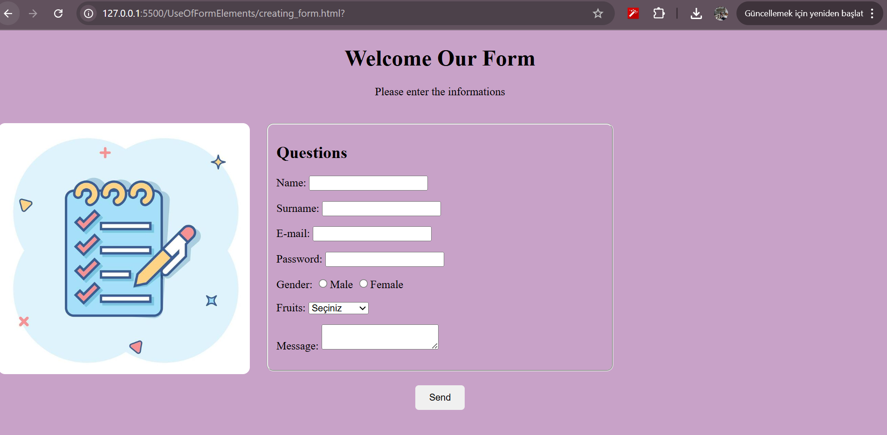

# HTML Form Project

This project demonstrates a basic HTML form layout designed using only pure HTML and inline styling. 

## 📸 Screenshot

## 📌 Overview

The form collects user information and includes:

- Name & Surname
- E-mail & Password
- Gender (radio buttons)
- Favorite Fruit (dropdown list)
- Message (textarea)
- Submit Button

## ✨ Features

- Clean and simple HTML structure
- No CSS files – all styles are added via `style=""` attributes
- Image placement with `float: left` and `margin-top` for alignment
- Rounded edges and spacing for a smoother look

## 🖼️ Visual Layout Example

Here's how the layout is structured:
+----------------------+----------------------------+
| | |
| form.jpg | HTML Form |
| (left side) | (right side) |
+----------------------+----------------------------+

> The image used is named `form.jpg` and should be placed in the same folder as `creating_form.html`.

## 🗂 Folder Structure

project-folder/
├── creating_form.html
├── form.jpg
└── README.md

## 🚀 How to Use

1. Download or clone this repository.
2. Open `creating_form.html` in your web browser.

## 🎯 Learning Goals

This mini-project was created to practice:

- Form creation with various input types
- Field grouping using `<fieldset>`
- Basic layout styling using inline styles
- Visual enhancements without CSS files

